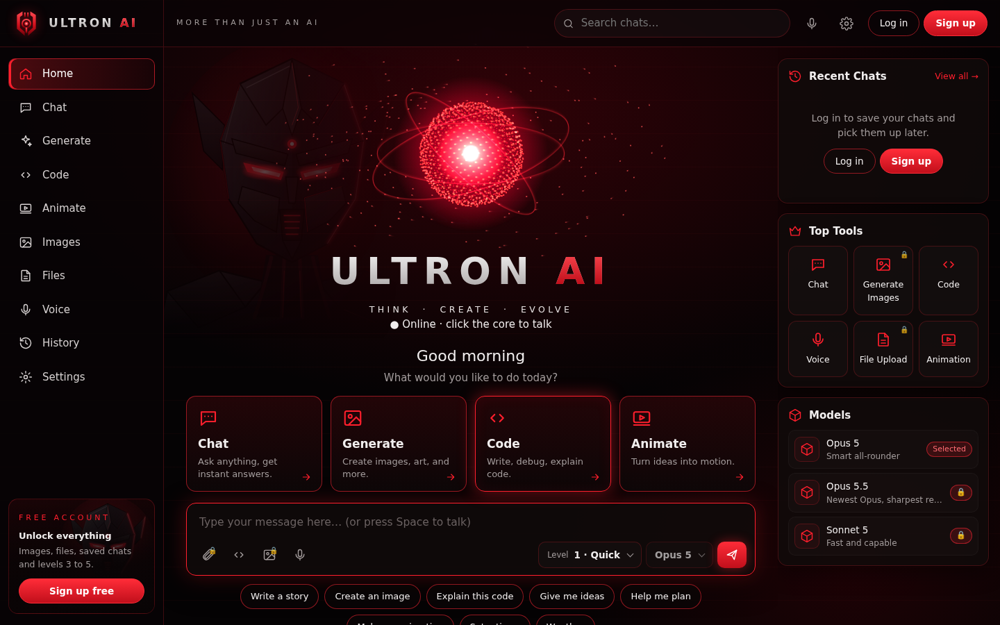
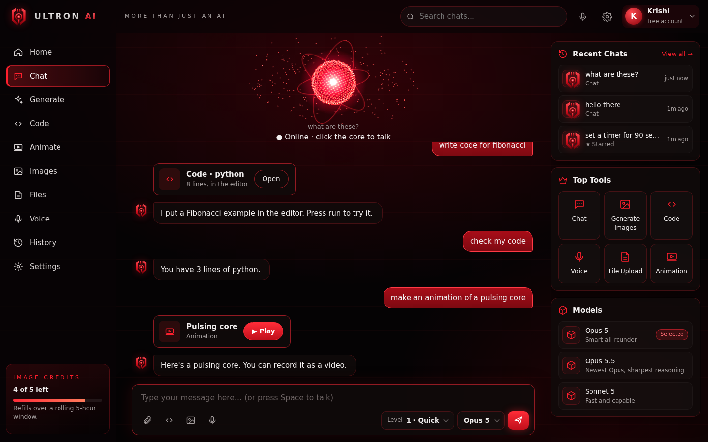
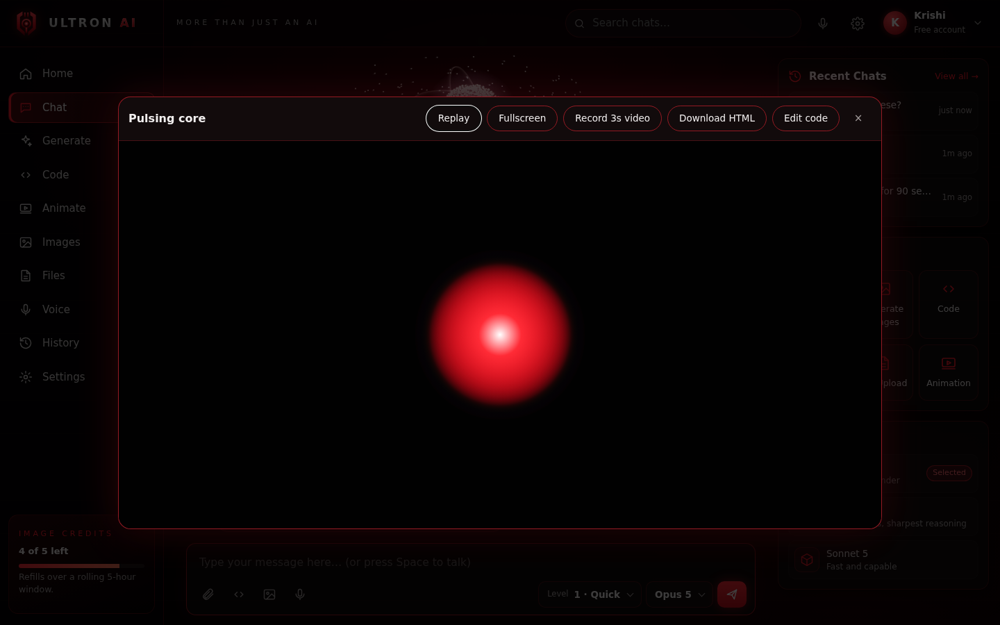
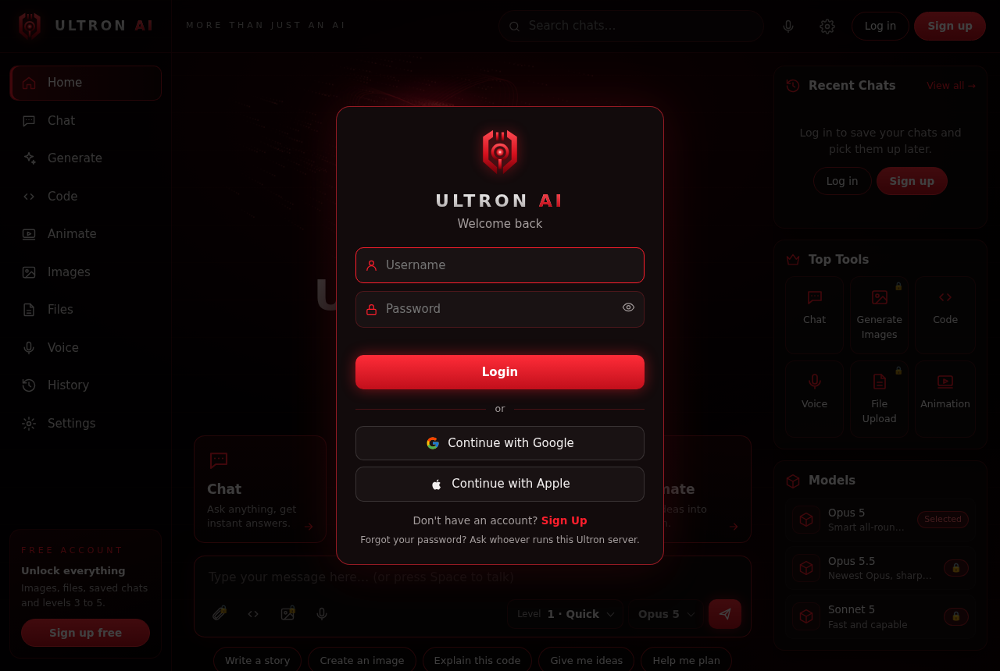
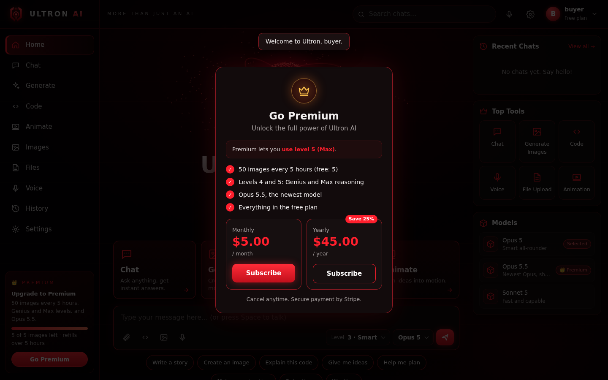
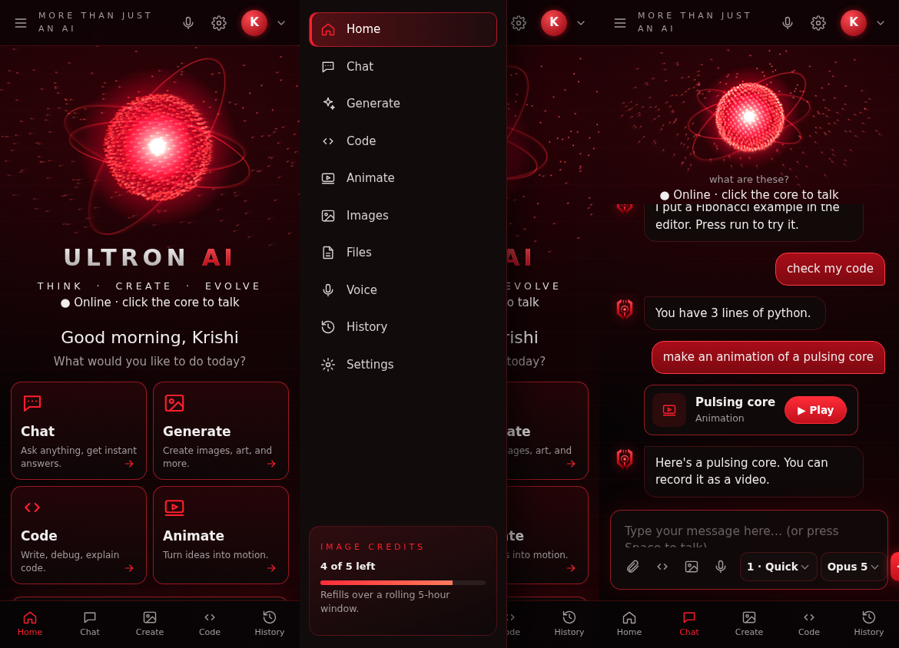

# Ultron AI

*Think · Create · Evolve.* A voice-first AI assistant with a living red core. It chats, writes and runs code, makes animations and images, reads your files, and keeps saved chats for everyone who signs up. Claude does the thinking.





## Setup

```bash
pip install -r requirements.txt
python setup_voice.py                 # one-time download of Ultron's voice (~350 MB)
export ANTHROPIC_API_KEY=sk-ant-...   # or run `ant auth login` once
export OPENAI_API_KEY=sk-...          # optional: turns on image generation
export STRIPE_SECRET_KEY=sk_test_...  # optional: sell Premium (see "Premium" below)
python server.py
```

Open **http://127.0.0.1:8765**. Chrome or Edge are best, because they have built-in speech recognition. Other browsers work too, but you have to type.

No key yet? `python server.py --mock` runs everything with a keyword bot that still uses the real tools. Try "set a timer for 10 seconds", "write code", "make an animation" or "draw a cat".

## What it does

| | |
|---|---|
| **Hands-free** | Say **"Ultron …"** or **clap twice** and speak. After Ultron answers, just reply; it keeps listening without the wake word. Say "stop" to cut it off. The whole app works by voice (see below). You can also click the core or press **Space**; **Esc** interrupts. |
| **Voice** | A low, deliberate, human-sounding voice generated locally (Kokoro), with moods (calm, warm, amused, excited, concerned, stern, sinister) that change the delivery and the core's color. Ultron's personality is cool, sardonic and a little menacing, but always helpful. |
| **Levels 1–5** | The Level menu sets how hard Claude thinks: 1 Quick, 2 Balanced, 3 Smart, 4 Genius, 5 Max. Higher levels give smarter answers but are slower and cost more. |
| **Models** | Opus 5 (default), Opus 5.5 and Sonnet 5, from the Model menu or the Models panel. |
| **Files (+)** | Attach pictures, PDFs, text and code files, and videos, using the paperclip, drag and drop, or paste. Claude can't watch video, so Ultron samples 4 to 10 still frames from it (no audio). |
| **Code** | A code panel where Claude writes, reads and fixes code. It runs **Python** in your browser (Pyodide, downloaded on first run), **JavaScript** in a sandboxed worker (stopped after 10 seconds), and **HTML** as a live preview. Matplotlib charts show inline. |
| **Animate** | Ask for any animation. It plays in a player with Replay, Fullscreen, **Record video** (WebM or MP4), **Download HTML** and **Edit code**. |
| **Images** | "Generate an image of…" uses OpenAI's image model. Each account gets **5 images per 5 hours** (a rolling window that survives restarts). The Images page shows your gallery. |
| **Chats** | Every conversation is saved to your account, with search, star, rename and delete. **New chat** starts fresh. |
| **Tools** | Timers with alarms, weather (Open-Meteo, free), the current time, trending crypto and stocks (CoinGecko + Yahoo Finance, both free, no key). |
| **Trending** | A "Trending" card in the sidebar shows the top 3 trending cryptocurrencies and top 3 trending US stocks, loaded automatically the moment Ultron opens (and refreshed every 90 seconds) -- no need to ask. It says a short spoken line about it too, once per visit, unless you turn that off in Settings. |
| **Hands-free stays hands-free** | A voice conversation never jumps you to the text chat screen -- you stay wherever you are (home, code, wherever) and it's saved regardless; say "show the chat" to see it. Typing in the composer still opens the chat view as before. |



## Voice control

Wake Ultron by saying its name or clapping, then say what you want. App commands run instantly in the browser; anything else goes to Claude, which can also operate the app itself with its `control_app` tool (so "can you pull up my image gallery" works too). Say **"what can I say"** for the full list.

| Say | |
|---|---|
| "stop", "quiet", "never mind" | Stops talking (while it's talking, a bare "stop" works without the wake word) |
| "new chat", "open my chats", "open my last chat", "open the chat about …" | Chats |
| "go home", "show the gallery", "open settings", "go premium", "close" | Screens |
| "open the code editor", "run it", "stop the code", "close the editor" | Code |
| "replay", "record it" | The animation player |
| "level four", "genius mode", "think harder", "use Sonnet", "what level am I on" | Levels and models (locked ones show the upgrade screen) |
| "type …", "send it", "clear the message", "repeat that" | Writing |
| "scroll up", "scroll down", "go to the top" | Scrolling |
| "yes" / "no" | Confirm or cancel the open popup (e.g. "delete this chat?"). Otherwise they're answers for Ultron. |
| "go to sleep", "mute", "unmute", "turn off clapping", "single clap" | Voice settings |
| "log in", "sign up", "log out" | Account. Passwords are always typed, never spoken. |

Two things still need a tap, because browsers require one: the **START** screen (it unlocks sound for the visit), and the **file picker** for attachments.

**Clapping.** Settings has *Clap to wake* (off, one clap, two claps) and a sensitivity. The detector listens for the sharp spike of a clap that dies away fast, and only a lone clap or pair counts, so talking, music and typing don't set it off. It ignores claps while Ultron is talking and for a moment after you type or click. Two claps (the default) gives the fewest false starts.

**Keep listening after replies** (on by default) turns a question into a conversation: after answering something you said, Ultron listens for about as long as the browser's recognizer waits for speech, then goes back to standing by.

**Hand-gesture control** (Settings, off by default -- it asks for the camera) recognizes a few gestures on-device, no video ever leaves your machine: open palm to wake, a fist to stop, thumbs up/down to confirm or cancel a popup, and a peace sign for a new chat. A small preview pill in the corner shows what it currently sees.

**Hologram viewer.** Say "project a cube" (or torus, sphere, pyramid, cone, cylinder, diamond, or just "project the core" for Ultron's own orb), or click the Hologram tile. A live 3D wireframe appears, and you control it with your bare hands in front of the camera: spread both hands apart to grow it, bring them together to shrink it, move your hand to spin it, make a fist to dismiss it. "Project my image" projects your last generated image as a floating glowing card instead. Runs entirely in the browser (Three.js + on-device hand tracking); there's no text-to-3D model generation behind it, just Ultron's own shape and named primitives.

## Artwork

Ultron ships with your robot artwork (`static/art/robot.jpg`) in four places: behind the START screen, beside the core on Home, in the sidebar card, and in the "Unlock the full power" banner.

To use your own artwork, drop image files into `static/art/` with these names. Any of `.jpg`, `.png`, `.webp`, `.avif`, `.gif` or `.svg` works:

| File | Where it appears | Best shape |
|---|---|---|
| `splash.jpg` | Full-screen behind the START screen, darkened so the logo stays readable | Wide, 1920×1080 or larger |
| `hero.jpg` | Left side of Home, fading into the page | Portrait or square |
| `card.jpg` | Behind the sidebar card | Portrait |
| `banner.jpg` | Behind the "Unlock the full power" banner | Wide |
| `login.jpg` | The close-up panel beside the log-in and sign-up forms, with a slow drift and a pulsing glow on the eye | Portrait |

You don't need to restart; just reload the page. Any slot without a file keeps the built-in robot. The current `robot.jpg` was enlarged from a small 199×191 crop, so a full-resolution copy of the same artwork will look much sharper: save it over `static/art/robot.jpg`. Also in that folder are a 3D render (`robot-3d.jpg`) and a vector version (`robot.svg`); to use it instead, rename it to `splash.svg` / `hero.svg`, and so on.

## Plans: guest, free and Premium

| | Guest | Free account | **Premium** ($5 a month or $45 a year) |
|---|---|---|---|
| Voice, chat, timers, weather, code, animations | ✓ | ✓ | ✓ |
| Levels | 1–2 | 1–3 | **1–5** (Genius, Max) |
| Models | Opus 5 | Opus 5, Sonnet 5 | **+ Opus 5.5** |
| Attach files, saved chats | | ✓ | ✓ |
| Images per 5 hours | | 5 | **50** |

The server checks all of these on every request, so nobody can get around them by editing the page. To change them, edit `GUEST`, `FREE` and `PREMIUM` in `auth.py`, or set `ULTRON_IMAGE_LIMIT` and `ULTRON_PREMIUM_IMAGE_LIMIT`.

**Without Stripe configured, there's no Premium**, and every account gets everything except the bigger image allowance (levels 1–5, all models, 5 images).

Passwords are stored hashed with scrypt and a salt. Sessions are HttpOnly cookies that last 30 days. After five wrong passwords, that username is locked for 15 minutes from the address that made them. Everything is kept under `data/`: users, sessions, chats and images, with one folder per person.

## Password reset by email

The log-in screen has **Forgot password?**. People enter their username or email and get a link that works once, for one hour. Following it lets them choose a new password, which signs them out on every other device. Accounts need an email address for this: there's an optional field at sign-up, and **Settings → Email** adds or changes it (it asks for the current password). People can also log in with their email instead of their username.

**Safety measures:**
- The reply is the same whether or not an account exists, so the form can't be used to discover who has an account.
- Only a fingerprint (hash) of each link is stored.
- Each account gets at most 3 reset emails an hour, and each network address at most 10 requests.

**Setup:** point Ultron at any SMTP email service:

```bash
export SMTP_HOST=smtp.gmail.com SMTP_PORT=587
export SMTP_USER=you@gmail.com SMTP_PASSWORD="your app password"   # Gmail: myaccount.google.com/apppasswords
export SMTP_FROM="Ultron AI <you@gmail.com>"
export ULTRON_PUBLIC_URL=https://your-domain                      # the address used in the emailed link
```

| Service | `SMTP_HOST` | Notes |
|---|---|---|
| Gmail | `smtp.gmail.com` | Needs 2-step verification and an app password. Fine for small use. |
| Outlook / Microsoft 365 | `smtp.office365.com` | |
| SendGrid | `smtp.sendgrid.net` | `SMTP_USER=apikey`, `SMTP_PASSWORD=` your API key |
| Mailgun / Amazon SES / Resend / Postmark | from their dashboard | Best for a public site: verify your domain for good delivery |

`SMTP_SECURITY` is `starttls` by default. Use `ssl` for port 465, or `none` for a local test inbox like Mailpit. To develop without an email service, set `ULTRON_MAIL_TO_CONSOLE=1`, and emails are printed in the terminal instead of sent.

If email isn't set up, the log-in screen says to ask whoever runs the server, and they can delete the account from `data/users.json`.

## Sign in with Google and Apple



The **Continue with Google** and **Continue with Apple** buttons appear on the log-in and sign-up screens once you configure them. Signing in creates an account linked to that Google or Apple ID, with no password. Signing in again returns to the same account.

**Security:** Ultron checks the ID token's signature against the provider's published keys, along with its issuer, audience, expiry and a one-time nonce. Google sign-in also uses PKCE. The sign-in state is single-use and tied to the browser that started it.

Set `ULTRON_PUBLIC_URL` to your site's exact address (for example `https://ultron.example.com`). It must match what you register with Google and Apple.

**Google** (free, and works on `http://localhost` for testing):
1. Go to console.cloud.google.com → APIs & Services → **OAuth consent screen**, and fill it in (app name, support email).
2. Go to **Credentials** → Create credentials → **OAuth client ID** → *Web application*. Add the authorized redirect URI `https://YOUR-DOMAIN/auth/google/callback`, or `http://localhost:8765/auth/google/callback` for local testing.
3. Set `GOOGLE_CLIENT_ID` and `GOOGLE_CLIENT_SECRET`.

**Apple** (needs a paid Apple Developer account, and HTTPS on a real domain; Apple doesn't allow localhost):
1. At developer.apple.com → Certificates, IDs & Profiles, create an **App ID** with *Sign in with Apple* enabled.
2. Create a **Services ID** (for example `com.yourname.ultron.web`). Enable Sign in with Apple, and configure it with your domain and the return URL `https://YOUR-DOMAIN/auth/apple/callback`.
3. Under **Keys**, create a key with Sign in with Apple and download the `.p8` file. You can only download it once.
4. Set `APPLE_CLIENT_ID` (the Services ID), `APPLE_TEAM_ID` (top right of the developer site), `APPLE_KEY_ID`, and `APPLE_PRIVATE_KEY_FILE=/path/to/AuthKey_XXXX.p8`.

Apple shares the person's name only the first time they sign in, and may hand over a private relay email address. Ultron handles both. If you set an invite code (`ULTRON_SIGNUP_CODE`), new Google and Apple sign-ups are turned off, because there's nowhere to type the code; existing linked accounts still work.

## Premium (Stripe)



People pay on Stripe's own checkout page, so card details never touch your server. They manage or cancel their subscription on Stripe's customer portal ("Manage subscription" in the account menu).

**One-time setup** (start in Stripe *test mode*, where card `4242 4242 4242 4242` always succeeds):

1. Get your secret key from dashboard.stripe.com → Developers → API keys, then create the product and prices:
   ```bash
   export STRIPE_SECRET_KEY=sk_test_...
   python setup_stripe.py                 # $5/month and $45/year; change with --monthly / --yearly / --currency
   ```
2. In the Stripe dashboard, open **Settings → Billing → Customer portal** and press **Save** once. This turns on the portal.
3. Set up **webhooks**. These keep Premium in sync with renewals, cancellations and failed payments.
   - On your own computer, install the Stripe CLI and run `stripe listen --forward-to localhost:8765/api/stripe/webhook`. Put the `whsec_...` it prints in `STRIPE_WEBHOOK_SECRET`.
   - On a real server, go to Developers → Webhooks → Add endpoint, use `https://YOUR-DOMAIN/api/stripe/webhook`, and pick the events `checkout.session.completed`, `customer.subscription.created`, `customer.subscription.updated` and `customer.subscription.deleted`. Put its signing secret in `STRIPE_WEBHOOK_SECRET`.
4. Start Ultron. It prints `Premium: $5.00/month, $45.00/year` when everything is found.

**How it stays correct:**
- Premium switches on as soon as someone returns from checkout. Ultron confirms the payment with Stripe directly, even before the webhook arrives.
- A cancelled subscription stays Premium until the end of the paid period.
- A failed renewal keeps Premium while Stripe retries the card. If Stripe gives up, the account goes back to free.
- If a webhook is ever missed, Ultron checks with Stripe itself once a paid period has ended.
- Webhooks are verified with your signing secret, and forged ones are rejected.

When you're ready to charge real money, switch to your live key (`sk_live_...`), run `setup_stripe.py` again, create a live webhook endpoint, and set `ULTRON_PUBLIC_URL=https://your-domain`. You're responsible for your own terms, refunds and taxes; Stripe Tax can handle the taxes.

## Sharing it with other people

By default Ultron only listens on your own computer. To let others use it:

1. **Protect your API bill.** Everyone who uses Ultron spends your Anthropic (and OpenAI) credit, including guests and free accounts. Set `ULTRON_SIGNUP_CODE=something-secret` so only people you give the code to can sign up, or set `ULTRON_SIGNUP=closed` after creating accounts.
2. **Use HTTPS.** Put it behind a reverse proxy such as Caddy or nginx, start it with `--host 0.0.0.0`, and set `ULTRON_SECURE_COOKIES=1`. Without HTTPS, passwords travel unencrypted.

## Configuration

| Env var / flag | Default | |
|---|---|---|
| `ULTRON_MODEL` | `claude-opus-5` | Default model |
| `ULTRON_EFFORT` | `low` | Level used if the page doesn't send one |
| `ULTRON_VOICE` | `am_michael:0.7,am_onyx:0.3` | Kokoro voice or weighted blend, e.g. `am_michael`, `am_onyx`, `bm_george` |
| `ULTRON_VOICE_FX` | `edge` | Adds a faint synthetic shimmer to the voice; `human` leaves it natural |
| `ULTRON_VOICE_CHEST` | `0` | Low-end "chest" weight added under the voice; try `0.3`–`0.4` |
| `ULTRON_TTS` | `kokoro` | `browser` uses the browser's built-in voice |
| `ULTRON_LOCATION` | *(unset)* | Home city for weather, e.g. `"Bangalore, India"` |
| `OPENAI_API_KEY` | *(unset)* | Turns on image generation |
| `OPENAI_IMAGE_MODEL` | `gpt-image-2` | OpenAI image model |
| `OPENAI_IMAGE_QUALITY` | `medium` | `low` / `medium` / `high` (higher costs more) |
| `ULTRON_IMAGE_LIMIT` / `ULTRON_PREMIUM_IMAGE_LIMIT` | `5` / `50` | Images per window, free and Premium |
| `ULTRON_IMAGE_WINDOW_HOURS` | `5` | Length of the rolling image window |
| `STRIPE_SECRET_KEY` | *(unset)* | Turns on Premium |
| `STRIPE_WEBHOOK_SECRET` | *(unset)* | Verifies Stripe webhooks |
| `STRIPE_PRICE_MONTHLY` / `STRIPE_PRICE_YEARLY` | *(unset)* | Use your own price IDs instead of the ones `setup_stripe.py` makes |
| `ULTRON_PUBLIC_URL` | *(from the request)* | Your site's address, used for Stripe's return links and the Google/Apple redirect addresses |
| `SMTP_HOST` / `SMTP_PORT` / `SMTP_USER` / `SMTP_PASSWORD` / `SMTP_FROM` / `SMTP_SECURITY` | *(unset)* / `587` / … / `starttls` | Email for password resets |
| `ULTRON_MAIL_TO_CONSOLE` | *(unset)* | `1` prints emails in the terminal instead (for development) |
| `GOOGLE_CLIENT_ID` / `GOOGLE_CLIENT_SECRET` | *(unset)* | Turns on Sign in with Google |
| `APPLE_CLIENT_ID` / `APPLE_TEAM_ID` / `APPLE_KEY_ID` / `APPLE_PRIVATE_KEY_FILE` | *(unset)* | Turns on Sign in with Apple |
| `ULTRON_SIGNUP` | `open` | `closed` stops new sign-ups |
| `ULTRON_SIGNUP_CODE` | *(unset)* | Invite code required to sign up |
| `ULTRON_SECURE_COOKIES` | *(unset)* | `1` when served over HTTPS |
| `--host` / `--port` | `127.0.0.1` / `8765` | |

## How it works

```
browser ── speech recognition ──► POST /api/chat ──► server.py ──► Claude (streaming, with tools)
   ▲                                                    │  └──► tools.py: timers, weather, time, code editor,
   │                                                    │                  animations, OpenAI images (quota)
   └── audio clips ◄── POST /api/tts (Kokoro) ◄─────────┘
```

- `server.py` handles HTTP, the Claude tool loop, chat storage and permissions.
- `auth.py` handles accounts, sessions, plans, and what each plan can do.
- `oauth.py` handles Sign in with Google and Apple, and `mailer.py` sends email.
- `billing.py` handles Stripe checkout, the customer portal and webhooks, and `setup_stripe.py` creates the product and prices.
- `tools.py` holds the tools Claude can call. To add one, add a schema to `TOOLS` and a handler to `HANDLERS`.
- `tts.py` generates the voice, and `setup_voice.py` downloads its model.
- `static/voice.js` handles voice commands, follow-up listening and clap detection (an AudioWorklet).
- `static/`: `index.html` (layout and theme), `app.js` (core, voice, orb), `composer.js` (message box and files), `code.js` (editor, runners, animation player), `chats.js` (transcript, history, images), `account.js` (log-in, sign-up, splash, settings).

Code from Claude never runs on the server. It runs in browser sandboxes that can't see Ultron's page, cookies or other chats.


